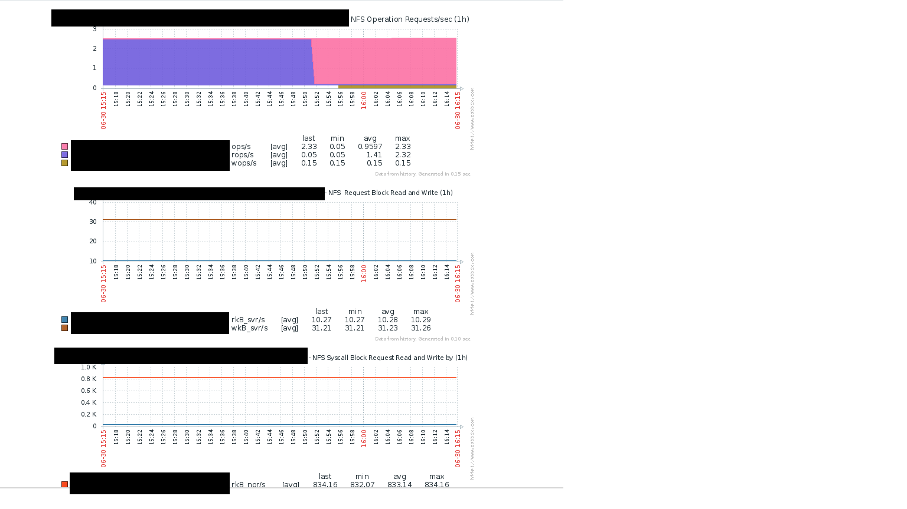

# zbx-nfsiostat-sysstat
Zabbix Basic template for NFS  -  nfsiostat-sysstat

zbx-nfsiostat-sysstat is basic Zabbix LLD template use to display  sysstat nfsiostat 

## NOTE
This template is Zabbix Template active template. 

* mount-nfs-discovery.sh - Get nfs mouunt point 
* nfsiostat-check.sh - Zabbix LLD script 
* userparameter_unixdev_nfs_io_stat.conf - Zabbix user parameter file
* zbx_template_nfsiostat_sysstat.xml - Zabbix Template  

Base from : jizhang iostat script - https://github.com/jizhang/zabbix-templates

## Usage 
1. copy  mount-nfs-discovery.sh  nfsiostat-check.sh to /usr/local/bin
1. copy userparameter_unixdev_nfs_io_stat.conf to /etc/zabbix/zabbix_clientd.d/
1. Import Zabbix template ```zbx_tempalte_nfsiostat_sysstat.xml``` to zabbix  
1. reload zabbix-agent service  
It's not complete but work for me. :) 


